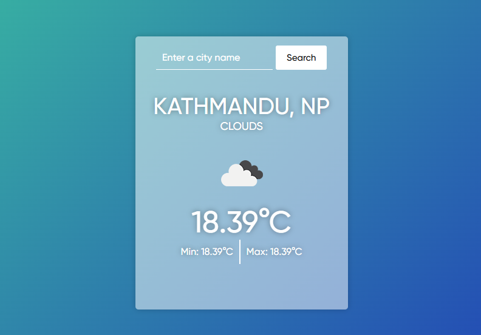

## Table of contents

- [Overview](#overview)
  - [Screenshot](#screenshot)
  - [Links](#links)
- [My process](#my-process)
  - [Built with](#built-with)
  - [What I learned](#what-i-learned)
  - [Continued development](#continued-development)
- [Author](#author)

## Overview

### Screenshot

### Links

- Solution URL: (https://github.com/sujwal19/weatherApp)
- Live Site URL: ()

## My process

1. Create html structure
2. Add stye to that elements
3. Select all needed elements in JS
4. Add eventListener for form
5. Use async function to fetch the api
6. Use promise to use the data returned by async function
7. Directly edit all html element by pasting it in JS
8. Update the container with new Values.

### Built with

- FORM, INPUT
- CSS custom properties
- ASYNC AWAIT, PROMISES, FETCH API

### What I learned

I learned basics of async await, how to work with promises.
toFixed(2) => it tells us how many decimal to put after .
; => it works as line break 

### Continued development

1. Add loading animation when you search for new city
2. Add bodyy background according to weather condition
3. Later, Improve its UI desing and add other CSS animations.

## Author

- Twitter - [@sujwal19](https://x.com/SujwalBuilds)
